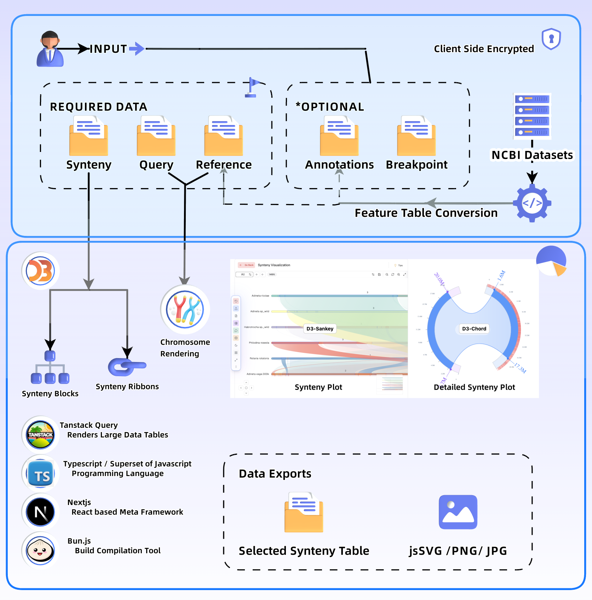

# CHITRA: Interactive Chromosomal Rearrangement Visualization

CHITRA is a web-based tool for interactive visualization of synteny blocks, chromosomal rearrangements, and breakpoints.

## Abstract

CHITRA is a web-based tool designed to bring the complexity of genome organization to life. We offer an intuitive interface to visualize:

Ready to dive in?

   
  <h3 align="center">
    <a href="https://chitra.bioinformaticsonline.com">✨ Try it out</a>
    &nbsp;•&nbsp;
    <a href="https://chitra.bioinformaticsonline.com/docs">📖 Learn more</a>
  </h3>

## Features

*   Interactive linear and circular (chord map) visualizations.
*   Customizable ribbon colors for rearrangement types.
*   Breakpoint mapping.
*   Gene annotation integration.

  
   
  <em>Figure 1. CHITRA workflow.</em>

## Implementation

Built with ❤️, React, ShadCN UI, Tailwind CSS, Motion, D3.js, and jsSVG.

## Availability

*   Web: [https://chitra.bioinformaticsonline.com/](https://chitra.bioinformaticsonline.com/)
*   Docs: [https://chitra.bioinformaticsonline.com/docs](https://chitra.bioinformaticsonline.com/docs)
*   Source: [https://github.com/pranjalpruthi/CHITRA](https://github.com/pranjalpruthi/CHITRA)

## Get Started! (Locally) 🚀

1.  Clone: `git clone https://github.com/pranjalpruthi/CHITRA.git`
2.  Install: `bun install`
3.  Run: `bun dev`

## Funding

Funded by The Rockefeller Foundation and CSIR-IGIB.

## License

MIT License.

